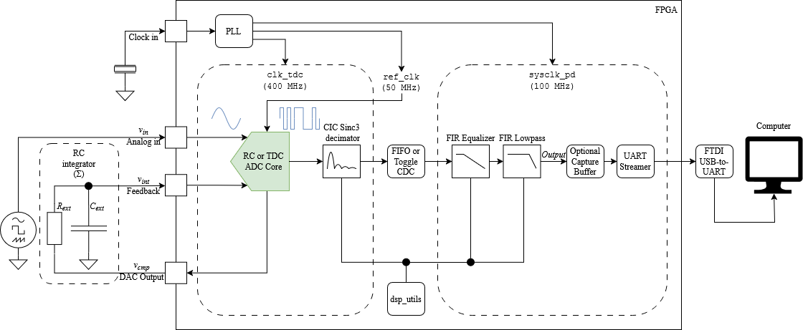

# An FPGA-Based Delta-Sigma ADC Using LVDS Comparators Achieving 9.7 ENOB, with an Exploratory TDC-Augmented Architecture Extension

Master's Thesis project at NTNU implementing a Delta-Sigma ADC on the Intel Agilex 5 FPGA.



## Project Overview

This project implements a Delta-Sigma ADC on the AXE5000 development board as part of a Master's Thesis at NTNU.

There are two available architecture variants:

- **RC-Based ADC** (`rc_adc_top`): A robust, simplified architecture using a 1-bit feedback DAC and an external RC network. This is the **default active design**.
- **TDC-Based ADC** (`tdc_adc_top`): A Work-In-Progress (WIP) architecture that builds upon the RC design by adding a Time-to-Digital Converter (TDC) to quantize the comparator error. **Note:** This module is currently experimental and primarily contributes noise in its current state.

## Key Specifications

- **Resolution**: 16-bit signed output (Q15 format)
- **Effective Number of Bits (ENOB)**: 9.7 bits
- **Sample Rate**: ~97.7 kSPS (50 MHz / 512 Decimation)
- **Input Voltage Range**: 0.1V - 1.3V
- **Tools Used**: Intel Quartus Prime Pro 25.3, Platform Designer

## Project Structure

- `sources/`: VHDL source files.
- `scripts/`: Python tools for monitoring and analysis.
- `adc_system/`: Platform Designer system integration (Agilex 5 GPIO/PLL).
- `testbench/`: VUnit testbenches.
- `run.py`: Simulation runner script.

## Operation Modes

The design supports two modes of operation, configurable in the top-level VHDL:

1.  **Stream Mode (Default)**:
    -   Continuously outputs conversion results over UART.
    -   Simple ASCII Hex format (e.g., `ABCD\n`).
    -   Visualized in real-time using `scripts/adc_monitor.py`.

2.  **Burst Mode (Optional)**:
    -   Captures a high-speed buffer of samples (up to 128k) in internal block RAM.
    -   Allows for precise analysis of contiguous samples without UART bandwidth limitations.
    -   Triggered via UART commands (`C` to capture, `D` to dump).
    -   *Requires uncommenting the capture logic in `axe5000_top.vhd`.*

## Configuration & Instantiation

The design uses `axe5000_top.vhd` as the top-level entry point. The default configuration uses the **RC ADC** in **Stream Mode**.

To enable advanced features, edit `sources/axe5000_top.vhd`:

### Switching to TDC ADC (Experimental)
Comment out the `rc_adc_top` instance and uncomment the `tdc_adc_top` instance block.

```vhdl
-- i_adc : entity work.rc_adc_top ...
i_adc : entity work.tdc_adc_top ...
```

### Enabling Burst Mode
Uncomment the `adc_capture` instantiation and the associated logic signals (`capture_start`, `dump_data`, etc.). Ensure `GC_CAPTURE_ENABLED` is set appropriately or the generate block is active.

## Scripts

-   `adc_monitor.py`: Real-time UART monitor and plotter.
    -   Run: `python scripts/adc_monitor.py`
-   `tdc_monitor.py`: Low-level diagnostic tool for TDC codes.
-   `generate_coefficients.py`: Generates FIR filter coefficients.
-   `uart_cmd.py`: Command-line utility for FPGA control.

## Simulation

Simulations are managed via VUnit.

```bash
python run.py
```

Arguments:
- `-c`: Enable coverage.
- `-f`: Fast mode (no waveform visualization).

## Getting Started

1.  **Build**: Open `axe5000_top.qpf` in Quartus Prime Pro 25.3 and compile.
2.  **Program**: Load the `.sof` file to the AXE5000 board.
3.  **Run**: Connect USB-UART and launch the monitor:
    ```bash
    python scripts/adc_monitor.py
    ```
